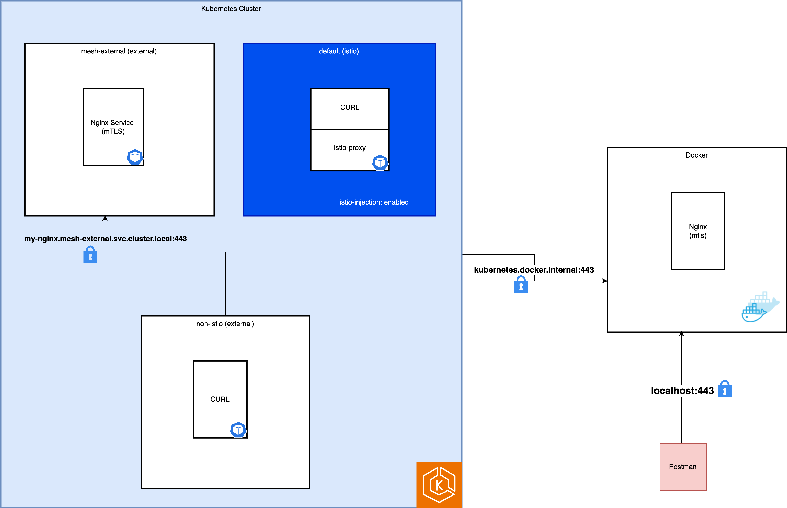

# Connecting to External Services with mTLS and Istio

I am working on connecting to an external service from my app by offloading the mTLS responsibility to the service mesh. To test this locally, I followed the instructions in the Istio documentation and successfully configured mTLS origination from the sidecar for `kubernetes.docker.internal` and `my-nginx.mesh-external.svc.cluster.local`.

However, I now need to achieve the same with a service that can only be accessed through my corporate proxy (port 3128). I created the secret, ServiceEntry, and DestinationRule as mentioned in the documentation, but it is still not working.

- Application -> Sidecar -> mTLS nginx service on local: ✅
- Application -> Sidecar -> corporate-proxy (3128) -> mTLS external service: ❌

Note: From the pod, I can successfully perform `curl --cacert --cert --key https://externalapi` after setting the `HTTPS_PROXY` environment variable.

Please advise if there is something different I need to do or help me understand what might be going wrong here.

- External API Reference: https://blogs.aspnet4you.com/2021/03/15/secure-your-business-api-with-mtls/
- External API is https://mtlsapi.aspnet4you.com/pets

# Current Status
- ✅ Application -> Sidecar -> mTLS nginx service on local
- ✅ Application -> Egress Gateway -> mTLS nginx service on local
- ✅ Application -> Sidecar -> mTLS public API (from personal computer)
- ❌ Application -> Egress Gateway -> mTLS public API (from personal computer) - Seems related to [issue](https://discuss.istio.io/t/istio-mtls-to-an-external-service/12473)

## From corporate machine: 
- ✅ Application -> Sidecar -> mTLS nginx service on local
- ⏳ Application -> Egress Gateway -> mTLS nginx service on local
- ⏳ Application -> Sidecar -> mTLS public API (To be verified, as i need the call to go via proxy)
- ⏳ Application -> Sidecar -> corporate proxy -> mTLS public API 
- ⏳ Application -> Egress Gateway -> corporate proxy -> mTLS public API 